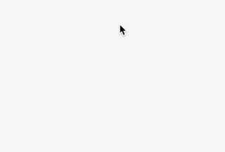
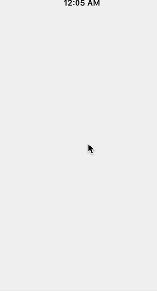
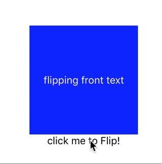

# Animate React Native 动画
本项目主要是学习并演示React Native动画API, 比如有定时和弹簧动画等等来演示动画样式属性,
并组合多种动画样式来创建更复杂效果.还有更多高级交互.
例如：触摸事件(touch events)、插值(interpolation)、翻转(flip)等动画.

**目前只支持Animated.Text / Animated.View / Animated.Image**

## 九个文件九中效果如下:
* 1、**Animated.timing**(value: AnimatedValue | AnimatedValueXY, config: TimingAnimationConfig)

  推动一个值按照一个过渡曲线而随时间变化。Easing模块定义了一大堆曲线，你也可以使用你自己的函数。

* 2、**Animated.spring**(value: AnimatedValue | AnimatedValueXY, config: SpringAnimationConfig)
  产生一个基于Rebound和Origami实现的Spring动画。它会在toValue值更新的同时跟踪当前的速度状态，以确保动画连贯。可以链式调用.

* 3、拖拽的卡片 **Pan Responder和Animated.decay**
  Animated.delay(time: number); //在指定的延迟之后开始动画.

* 4、**Interpolate** 实现变色效果

* 5、**Interpolate** 实现旋转

* 6、**Animated.sequence**

  按顺序执行一个动画数组里的动画，等待一个完成后再执行下一个。如果当前的动画被中止，后面的动画则不会继续执行.

* 7、**Animated.stagger**
  一个动画数组，里面的动画有可能会同时执行（重叠），不过会以指定的延迟来开始.

* 8、**Animated.parallel**
  同时开始一个动画数组里的全部动画。默认情况下，如果有任何一个动画停止了，其余的也会被停止。可以通过`stopTogether` 选项来改变这个效果。
  
* 9、Flip卡片效果

